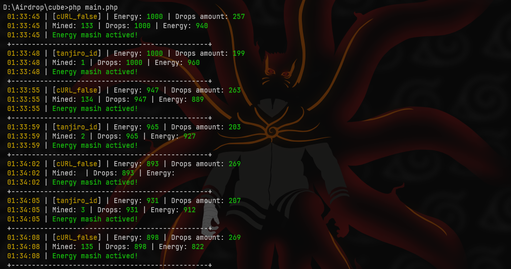

# bot-cube
Bot Telegram Cube


<center></center>

# licensikey **BOT-CUBE-1337**


<center></center><br>

# Fiture Bot
- [x] Auto Claim
- [x] Auto Buy Energy


# installing script
```
git clone https://github.com/ipkzone/bot-cube.git
cd bot-cube
php cube.php
```

# configurasi
```
Edit the config.txt file section and then replace the query_id data with your query_id account data
example for replace
query_id=AAFZxxxx
```

Regards,
**Iddant ID**
